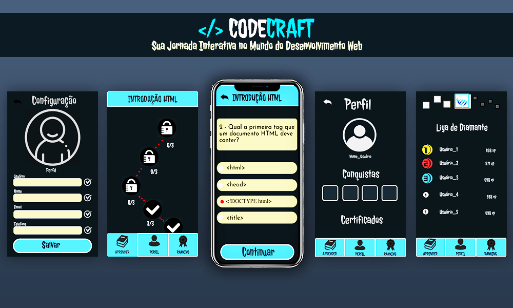

# PI GRUPO 5 - 1°SEM/2024

 

**Bem-vindo ao CodeCraft**, a plataforma de aprendizado online desenhada para transformar aspirantes em programadores habilidosos no universo do desenvolvimento web. Com cursos interativos em HTML, CSS e JavaScript, o CodeCraft é o seu aliado na conquista da fluência tecnológica.

Criado com o aluno da FATEC Araras em mente, o CodeCraft alinha-se perfeitamente ao currículo acadêmico, oferecendo uma experiência de aprendizado personalizada e dinâmica. Enfrente desafios progressivos que espelham as dificuldades reais das disciplinas de tecnologia, e avance no seu próprio ritmo.

Através de observação direta e feedback constante dos alunos, o CodeCraft foi meticulosamente calibrado para preencher lacunas de conhecimento e fortalecer a compreensão dos fundamentos do desenvolvimento web. Prepare-se para uma jornada de autoaprendizagem, onde cada desafio superado é um passo adiante na sua carreira tecnológica.

 

## Funcionalidades da Plataforma

- **Cadastre-se e Descubra:** Junte-se à nossa comunidade agora mesmo! Inscreva-se fornecendo apenas seu nome, e-mail e senha, e embarque na jornada de aprender programação de forma fácil e divertida!

- **Explore Conteúdos Interativos:** Mergulhe em tutoriais, vídeos e artigos sobre HTML, CSS e JavaScript. Tudo organizado para tornar seu aprendizado em desenvolvimento web mais claro e eficiente.

- **Teste Seus Conhecimentos:** Aceite o desafio com nossos quizzes interativos e problemas práticos de programação. Aprenda com exemplos de código e explicações detalhadas que iluminam cada conceito.

- **Evolua com Exercícios Progressivos:** Avance pelo caminho do conhecimento com exercícios que aumentam em dificuldade. Complete desafios, desbloqueie novos níveis e continue crescendo a cada passo.

- **Receba Feedback Instantâneo:** Obtenha avaliações imediatas após cada exercício ou quiz. Acompanhe seu progresso e mantenha-se motivado para alcançar novos patamares no seu aprendizado.

- **Pratique Codificação na Prática:** Exercite suas habilidades de codificação em um ambiente que simula desafios reais. Aplique diretamente o que aprendeu em HTML, CSS e JavaScript e veja seu código ganhar vida.

- **Suba no Ranking:** Mostre suas habilidades superando os desafios de programação. Veja seu nome subir no ranking e inspire-se para continuar melhorando suas habilidades de codificação.

 

## Tecnologias Utilizadas

- **Lógica do Servidor:** PHP
- **Banco de Dados:** MariaDB
- **Front-end Web:** HTML, CSS, JavaScript, Bootstrap
- **Aplicativo Mobile:** Desenvolvido com React Native (compatível com Android 11+)

 

## Equipe de Desenvolvimento

O CodeCraft foi trazido à vida graças ao empenho da nossa equipe talentosa:

- **Fernanda Mello e Bruno Alexander:** Elaboração da documentação fundamental para o projeto.
- **Rayanne Nunes e Luana Pelissaro:** Construção dos protótipos iniciais do aplicativo com foco em funcionalidade.
- **Isack Rossi e Juan Felipe:** Construção os primeiros protótipos do site, priorizando usabilidade.

Cada membro trouxe uma habilidade única para a mesa, colaborando para criar uma plataforma robusta e envolvente que atende às necessidades dos alunos.
